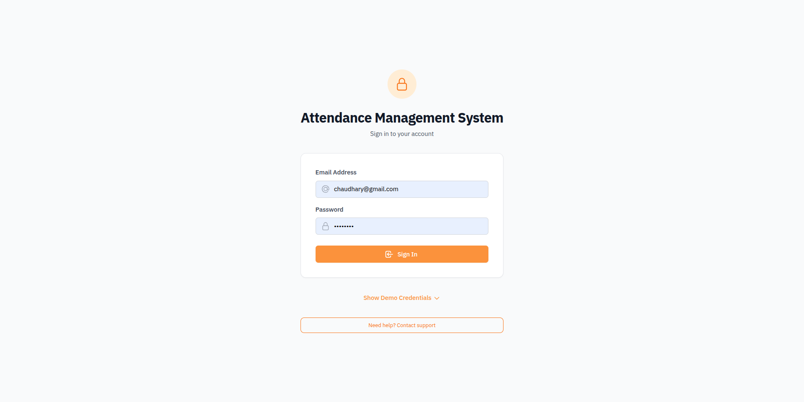
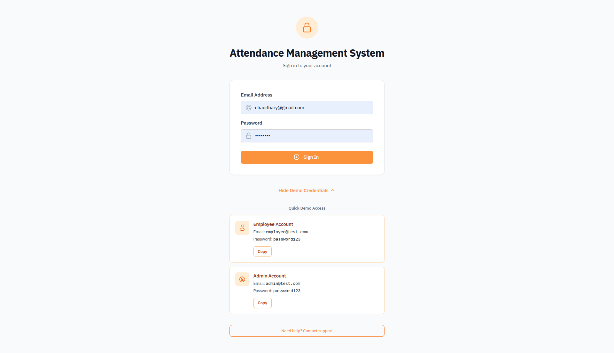
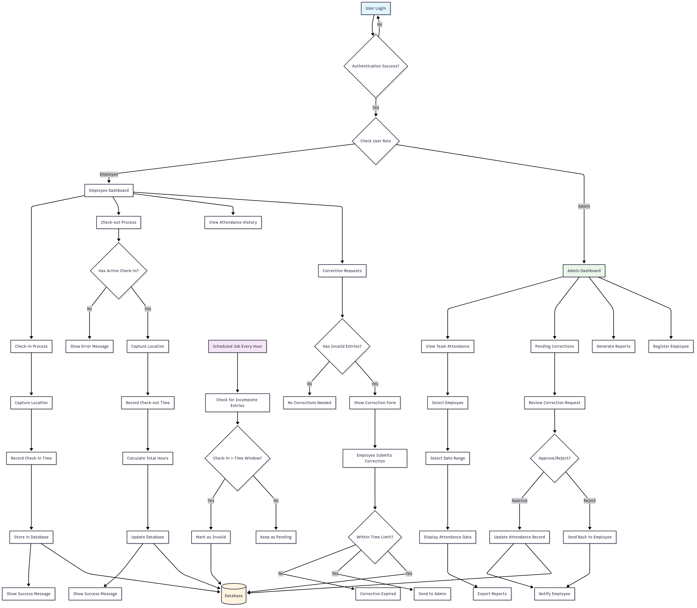
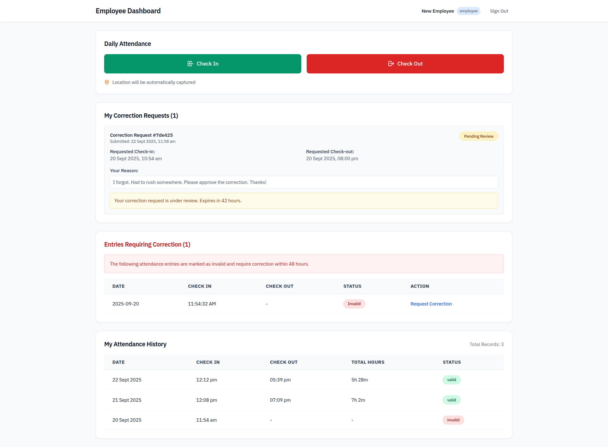
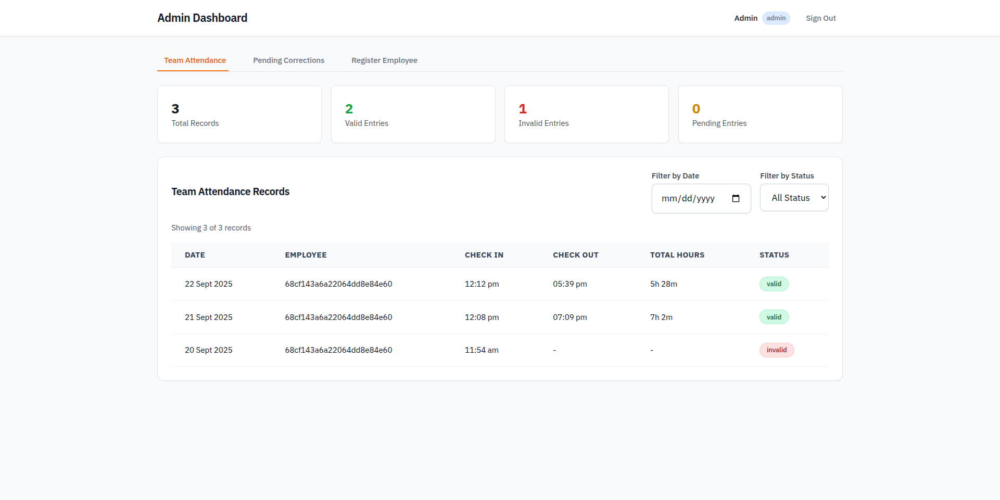
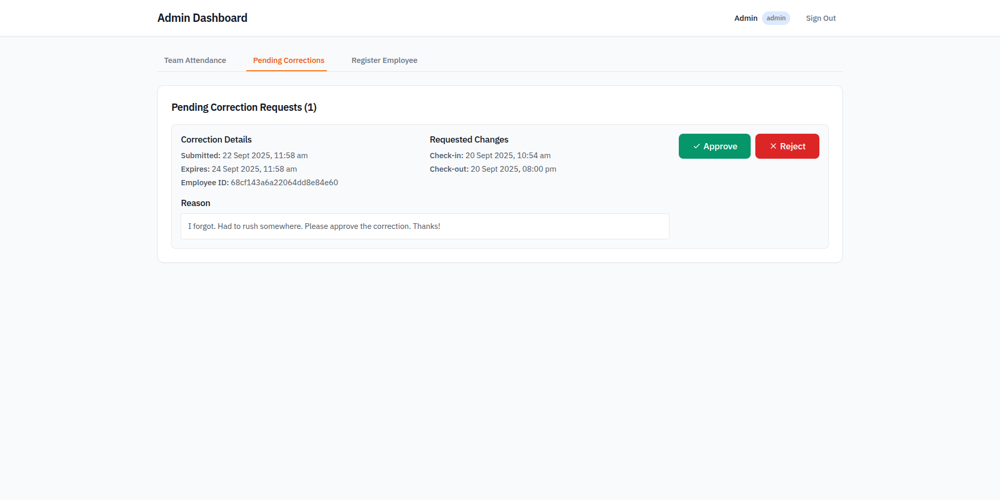
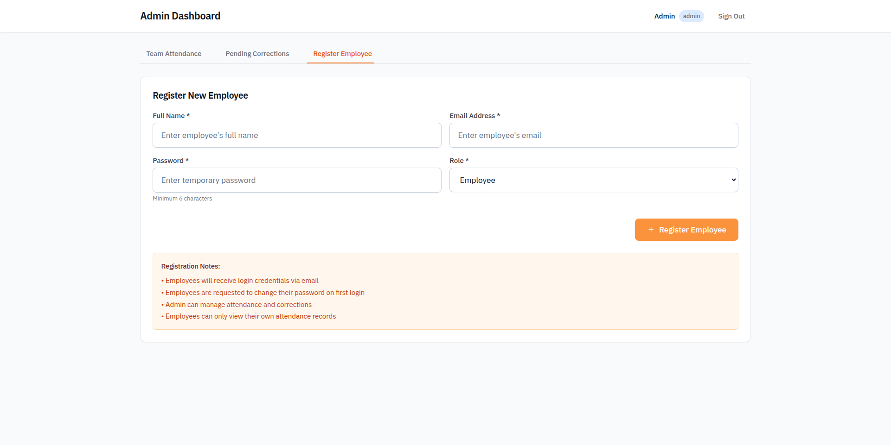
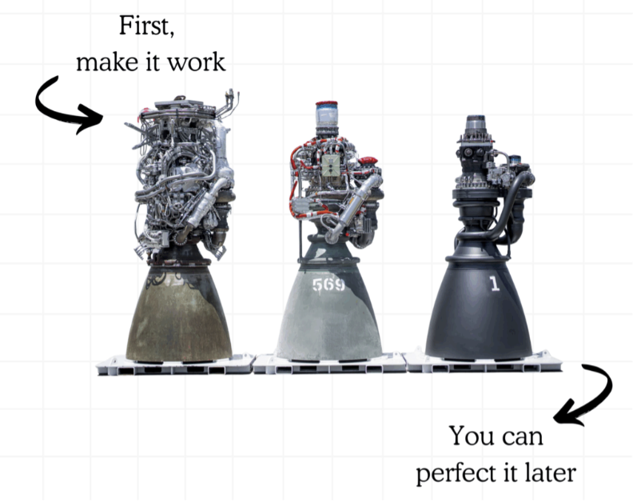

# Attendance Management System

A full-stack web application for employee attendance tracking with location verification, automated invalid entry detection, and approval workflows.

## Technology Stack

**Backend**: Go (Golang) with Gin framework, MongoDB, JWT authentication  
**Frontend**: React 18 with TypeScript, Vite, TailwindCSS, TanStack Query  
**Deployment**: Docker containers on Oracle Cloud Infrastructure

## Core Features

- Employee check-in/check-out with GPS location tracking
- Automated invalid entry detection (12-hour window)
- admin dashboard for team attendance management
- Time-bound correction requests (48-hour window)
- Role-based access control (Employee/admin)








## Architecture

```
┌─────────────────┐    ┌─────────────────┐    ┌─────────────────┐
│   React.tsx     │────│  Go Backend API │────│   MongoDB       │
│   (Port 3001)   │    │   (Port 8010)   │    │   (Port 27017)  │
└─────────────────┘    └─────────────────┘    └─────────────────┘
```




## Quick Start

### Prerequisites
- Docker and Docker Compose
- Git

### Clone Repository
```bash
git clone < https://github.com/Sourav01112/attendance-management-system.git >
cd attendance-management-system
```


### Run with Docker Compose
```bash
docker-compose -f docker-compose.local.yml build  && docker-compose -f docker-compose.local.yml up
```

### Access Application
- Frontend: http://localhost:3001
- Backend API: http://localhost:8010
- MongoDB: localhost:27017

## Demo Credentials

**Employee Access:**
- Email: employee@test.com
- Password: password123

**Admin Access:**
- Email: admin@test.com
- Password: password123







## API Endpoints

### Authentication
```
POST /api/auth/login - User login
```

### Employee Routes
```
POST /api/checkin - captures location and records check-in
POST /api/checkout - captures location and records check-out
GET /api/attendance - gets user's attendance records
GET /api/my-attendance - gets user's correction tracking 
POST /api/correction - submit correction request
```

### admin Routes
```
GET /api/team-attendance - View all employee attendance
GET /api/pending-corrections - Get pending correction requests
PUT /api/correction/:id/approve - Approve correction request
PUT /api/correction/:id/reject - Reject correction request
POST /api/register-employee - Register new employee
```

## Development Setup

### Backend Development
```bash
cd server
go mod tidy
go run ./cmd/server/main.go # from root of server directory
```

### Frontend Development
```bash
cd client
npm install
npm run dev
```

### Database Setup
MongoDB runs in Docker container with persistent volume storage. Database and collections are created automatically on first run.

## Production Deployment

### Oracle Cloud Infrastructure
- Instance: VM.Standard.A1.Flex
- Specs: 4 OCPUs, 24GB RAM, Ubuntu OS
- Container orchestration via docker-compose


## Security Features

- JWT token authentication with 24-hour expiry
- Password hashing with bcrypt
- Role-based route protection
- Input validation and sanitization
- CORS configuration for cross-origin requests


## Backup and Recovery

### Database Backup
```bash
docker exec attendance-mongodb mongodump --db attendance_db --out /backup
```

### Data Restore
```bash
docker exec attendance-mongodb mongorestore --db attendance_db /backup/attendance_db
```





Built as part of a technical assessment to showcase software engineering capabilities.